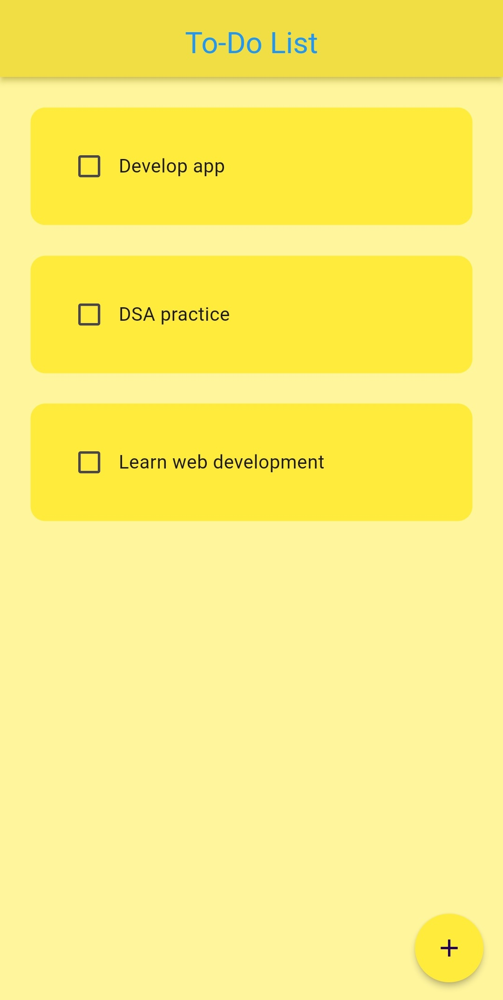
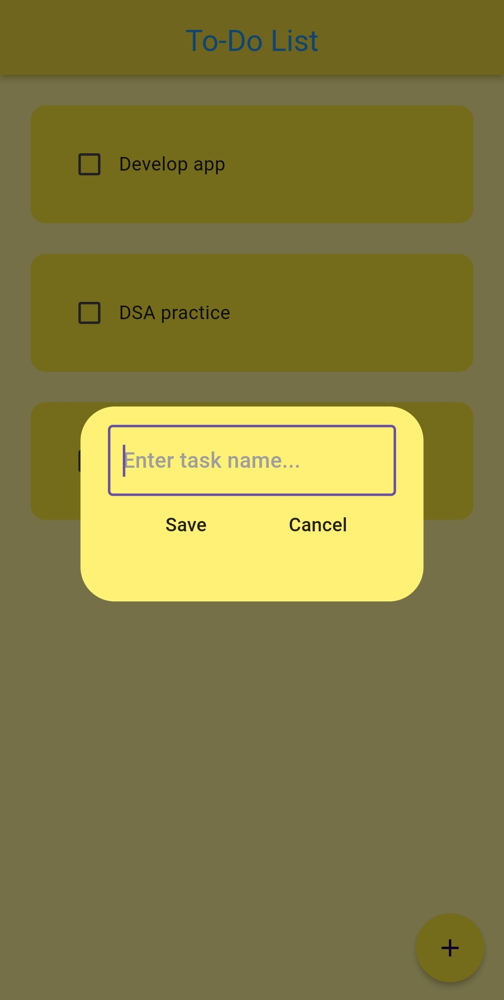
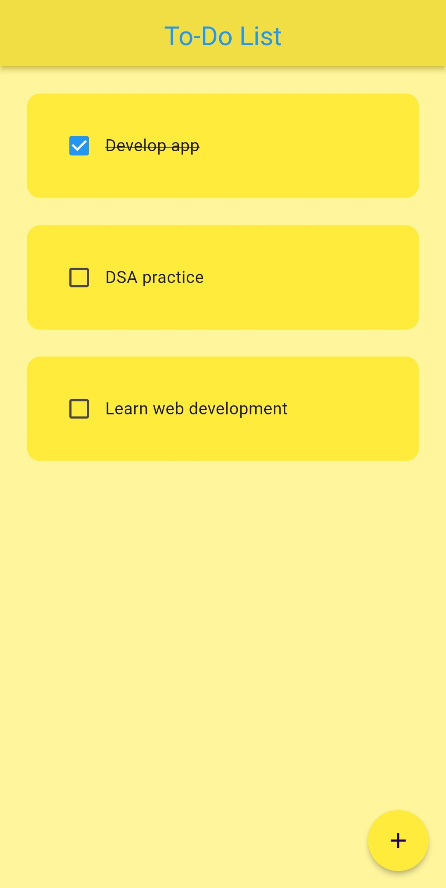
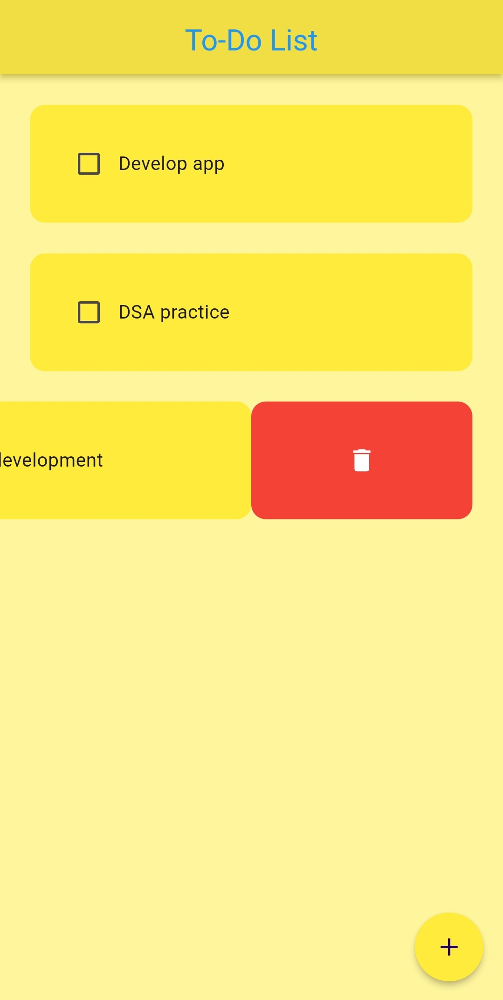

# To-Do List App

Welcome to the **To-Do List** app, a simple and intuitive task management app designed to help you track your daily tasks with ease. This project focuses on creating a clean user interface, local data persistence and smooth task management interactions.

This is my first Flutter project, where I explored concepts like UI design, local storage and custom widgets.

## Features

- **Add Tasks:** Use the floating action button at the bottom-right corner to add a new task. The button is marked with a `+` icon for easy identification.
- **Task Tiles:** Each task is represented by a tile that displays the task name and a checkbox.
- **Complete Tasks:** Mark tasks as completed by checking the checkbox. The task name will be visually updated with a strikethrough to indicate completion.
- **Delete Tasks:** Swipe a task tile horizontally (right to left) to reveal a delete button. Tap the delete button to remove the task from the list.
- **Persistent Data Storage:** The app saves tasks locally using the **Hive** database. Tasks are retained even after the app is closed and reopened.

## Screenshots

Here are some screenshots of the To-Do List app:

| Home Screen| Adding a New Task| Task Completed| Deletion|
|---|---|---|---|
|  |  |  | 

## Dependencies

This project uses the following Flutter packages:

- **[flutter_slidable](https://pub.dev/packages/flutter_slidable)**: Used for the swipeable action on the task tiles to reveal the delete button.
- **[hive](https://pub.dev/packages/hive)**: A lightweight and fast local database used for saving tasks locally.
- **[hive_flutter](https://pub.dev/packages/hive_flutter)**: Provides Flutter-specific adapters for Hive, allowing easy integration with Flutter projects.
- **[flutter_launcher_icons](https://pub.dev/packages/flutter_launcher_icons)**: Used to customize the app's launcher icon.

## Installation

### Prerequisites

Before running the app, make sure you have Flutter installed. You can follow the official [Flutter installation guide](https://flutter.dev/docs/get-started/install) to set up Flutter on your system.

### Steps

1. Clone this repository to your local machine:

   ```bash
   git clone https://github.com/RitamPatra/todo_app.git
   cd todo_app
   ```

2. Install the required dependencies:

   ```bash
   flutter pub get
   ```

3. To generate the custom launcher icon, run:


   ```bash
   dart run flutter_launcher_icons
   ```

4. Run the app on an emulator or connected device:

   ```bash
   flutter run
   ```

## Custom Icon

The app uses a custom launcher icon, which can be modified by replacing the image located at `assets/icon.png`. The `flutter_launcher_icons` package automatically updates the icon for both Android and iOS when you run the provided command.

## Learn More

To learn more about Flutter and its ecosystem, check out the following resources:

- [Flutter Official Documentation](https://docs.flutter.dev/)
- [Hive Documentation](https://pub.dev/documentation/hive/latest/)
- [Slidable Documentation](https://pub.dev/documentation/flutter_slidable/latest/)
